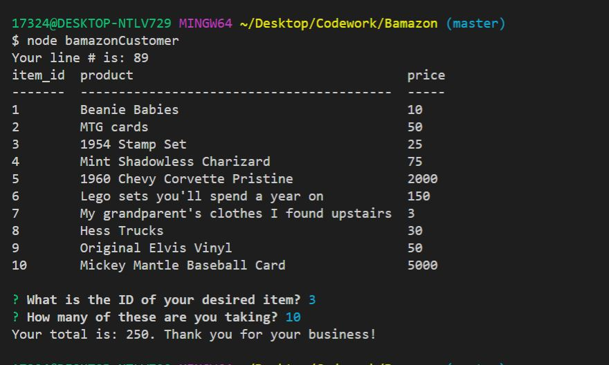

# Bamazon
Bamazon class HW

This is my customer side of the Bamazon app!
This was a little hard for me to do at first, but its getting easier over time.
The theme of this store is collectibles/valuables.
When ran, the application will present a list of inventory and prompt the user to pick an item and quantity of that item they want to buy.
Customer answer will be sent to the database and if inventory allows for the purchase it will update, else it will let the customer know.

**Built with:**
* [Node](https://nodejs.org/en/)
* [JavaScript](https://javascript.com/)
* [MySQL](https://www.mysql.com/)

## How to Use

1. Git clone this repository 
2. Navigate to the root folder in cloned repository (ends in /Bamazon)
3. Type node bamazonCustomer
4. Application should prompt you in the CLI

This screenshow shows two possible errors if the user inputs an item we don't have or want's more than our inventory.

This is the code that handles SQL and our messages

